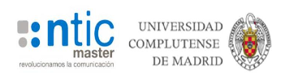

# TFM_BigData

Repository of the work research to the Final Master Thesis.

__NLP DECEITFUL REVIEW DETECTION ON E-COMMERCE AND SOCIAL MEDIA__

_Master of BIG DATA & BUSINESS ANALYTICS (2020 ed)._ 

_UNIVERSIDAD COMPLUTENSE DE MADRID._

__AUTHORS__:
Ainhoa Rodrigo Bolea (ainhoa2612@gmail.com)

Alejandra Lloret Calvo (alejandralloretc@gmail.com)

Cristian Fernando Rodríguez Saldarriaga (c.fernandoro@gmail.com)

Juan Pablo Guerrero Ortiz (jguerror41@gmail.com)

Laura Débora Fernández Basquero (ldfernandez09@gmail.com)

Marta Roig Atienza (martaroigatienza@hotmail.com)

